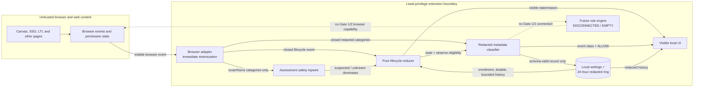

# Data-Flow Specification

Status: **Gate 1 design; Gate 2 observation path only**

This specification turns ADR 0001’s selected architecture into explicit trust boundaries. It does not describe a completed extension and does not authorize listeners, permissions, installation, live Canvas access, or traffic modification.

## Trust zones and components

| Zone / component | Authority and inputs | Outputs | Must not do |
| --- | --- | --- | --- |
| Browser + webpages | Browser owns tabs, windows, frames, permissions, lifecycle, and request events; pages and destinations are untrusted | Browser API events | Repository text or page content cannot instruct the product; page DOM is not read |
| Browser adapter | Minimum browser API capability for exact enrolled origins; volatile access to an event | Closed lifecycle event or redacted metadata categories | No logging/stringification; no body/header/cookie access; no persistence; no policy decision |
| Pure lifecycle reducer | Closed lifecycle events plus current authoritative snapshot | Deterministic context state and observation eligibility | No browser APIs, network, clock, storage, DOM, or side effects |
| Assessment tripwire | Versioned categorical route/frame facts | `suspected`, `not_suspected`, or `unknown` | No content, answer, login, grade, focus-history, or body inspection; unknown is suspected |
| Metadata classifier | Closed categorical record and local classifier revision | Event class, `ALLOW`, observation action, constant reason code | No raw URL/identifier; no remote lookup; no enforcement |
| Local state | Exact enrolled origins, disable setting, bounded redacted records | Settings and records to reducer/UI | No sync, browsing history, private data, raw events, or rule download |
| Visible UI | Derived state, reason codes, aggregate/redacted records | User enrollment, disable, delete actions | No hidden state, remote analytics, raw request display, or claim of login/attention |
| Future rule engine | **Disconnected and empty in Gate 1/2** | None | Cannot consume classifier output or install rules before ADR 0002 gates |

## Data-flow diagram



Dashed edges are prohibited in Gate 1 and Gate 2. The browser continues requests without waiting for the classifier.

## Flow contracts

| ID | Source → destination | Allowed data | Guard and failure result |
| --- | --- | --- | --- |
| `DF-01` | Browser → adapter | Current permission grant; tab/window/frame/navigation lifecycle event; volatile request URL/method/resource type when Gate 2 is authorized | Browser API boundary; exception discards event and enters `UNCERTAIN_ALLOW` |
| `DF-02` | Adapter → reducer | Closed event kind, context-local ephemeral membership key, exact-origin relation, private flag, navigation phase | Runtime type validation; unknown event triggers full reconciliation |
| `DF-03` | Adapter → assessment tripwire | Categorical route/frame facts | Unknown or mismatch returns `unknown`, which dominates as assessment-safe |
| `DF-04` | Adapter → classifier | Only fields allowed by the metadata schema, before time/retention completion | Raw URL/host/path/query/fragment and identifiers are absent; schema failure means `SKIP` + allow |
| `DF-05` | Reducer → classifier | Lifecycle state and boolean observation eligibility | Only `ACTIVE_OBSERVE` permits a redacted record; every other state skips |
| `DF-06` | Classifier → network | No blocking output; constant `ALLOW` is a receipt, not an intercepted decision | Gate 1/2 API surface has no deny/modify vocabulary |
| `DF-07` | Classifier → storage | Closed-schema record | `additionalProperties: false`, 500-record cap, 24-hour maximum; write failure enters uncertain allow |
| `DF-08` | Settings storage → reducer/UI | Exact enrolled HTTPS origins, disable setting, schema version | Local-only; invalid settings stop observation without deleting user data |
| `DF-09` | Storage/reducer → UI | State, constant reason, aggregate counts, redacted records | UI escapes text, uses native controls, and shows no origin in activity rows |
| `DF-10` | UI → local control | Explicit enroll/revoke, emergency disable/re-enable, delete-history action | User gesture, exact target preview, readback; actions never authorize enforcement |
| `DF-11` | Any component → remote service | Nothing | No telemetry, diagnostics, sync, accounts, remote rules, or remote code |
| `DF-12` | Classifier → future engine | Nothing in Gate 1/2 | Physical/module separation and ADR 0002; missing connection is intentional |

## Browser event normalization

The adapter vocabulary is closed:

- runtime: `START`, `WAKE`, `INSTALL`, `UPDATE`, `SUSPEND`, `SHUTDOWN`;
- permission: `PERMISSION_SNAPSHOT`, `PERMISSION_ADDED`, `PERMISSION_REMOVED`;
- surface: `TAB_SNAPSHOT`, `TAB_CREATED`, `TAB_COMMITTED`, `TAB_REMOVED`, `TAB_REPLACED`, `WINDOW_REMOVED`, `FRAME_CLASS_CHANGED`;
- user control: `DISABLE`, `REENABLE`, `ENROLL_ORIGIN`, `REMOVE_ORIGIN`, `DELETE_ACTIVITY`;
- fault: `ADAPTER_ERROR`, `SCHEMA_ERROR`, `STORAGE_ERROR`, `RULE_READBACK_MISMATCH`.

Browser-specific values are mapped to this vocabulary. Unknown event kinds do not pass through as strings; they produce `ADAPTER_ERROR` and reconciliation. Events can be duplicated, reordered, or absent. The reducer treats a new snapshot—not delivery history—as authoritative.

## Request metadata normalization

The browser may expose a request URL at `DF-01`. The adapter handles it as a short-lived capability:

```text
browser event
  -> verify context and exact enrolled-surface relationship
  -> parse in volatile memory
  -> remove query and fragment
  -> compare scheme/host/path to local exact evidence
  -> emit destinationClass + pathClass
  -> discard URL and browser event object
```

No raw request is queued while the reducer is unavailable. Backpressure drops observations; it never delays network traffic or retains raw events. Counts are not worth risking sensitive capture.

## Local state partitions

| Partition | Lifetime | Contents | Exclusions |
| --- | --- | --- | --- |
| Durable settings | Until explicit change/reset | Exact enrolled HTTPS origins; emergency-disable preference; settings version | No observed destinations, tabs, history, identity, sync |
| Volatile lifecycle | Runtime/context only | Ephemeral tab membership and SSO monotonic deadlines | No requests/content; never correctness authority after wake |
| Redacted activity | Up to 24 hours / 500 rows | Records conforming to `metadata-record.schema.json` | No origins, URLs, identifiers, private browsing, exact timestamps |
| UI view model | While UI is open | Derived state, constant reasons, redacted aggregates | No browser event objects or hidden export buffer |
| Future rule state | Empty in Gate 1/2 | Empty set only | No dormant rules or downloaded lists |

Browser sync storage is prohibited. A browser storage API is not automatically safe merely because it is named “local”; adapters must ensure the selected area does not sync or bridge private observations.

## UI behavior contract

The UI always shows one lifecycle state, a plain-language reason, whether observation is running, and that network behavior is “Allowing all traffic” in Gate 2. State is not conveyed by color alone. Emergency disable and delete-history are keyboard reachable and use native controls with visible focus.

The UI must not say “logged in,” “user present,” “safe to use on a quiz,” “no activity recorded,” or “tracking blocked.” It does not know those facts. `ASSESSMENT_SAFE` means the extension paused itself; it is not a statement about Canvas logging or course policy.

## Future rule-engine boundary

The future engine is shown to prevent accidental architectural collapse, not to authorize implementation. It must be a separate capability-bearing adapter invoked only by a later accepted gate. The pure reducer/classifier cannot import browser blocking APIs. Gate 2 manifests must not request blocking/DNR capability, and its schemas cannot express `BLOCK`, `REDIRECT`, or `MODIFY`.

See [ADR 0002](../adr/0002-enforcement-authorization-boundary.md) for the static authorization record, dynamic safety checks, institution boundary, and release gates.
