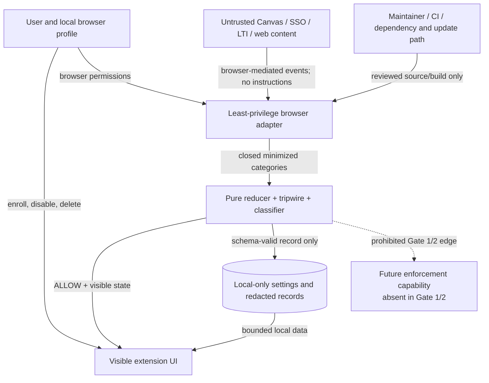

# Repository Threat Model

Status: **Gate 1 design model; hypotheses are not validated vulnerabilities**

Baseline: Research Gate 0 merge `e8f79a794e41a5042e817feeb29ed98f00638d72`.

This model covers the planned cross-browser WebExtension architecture, local contract artifacts, future dependency/build path, and the explicitly separate possibility of later enforcement. The repository currently contains research and contracts, not a browser extension. The architecture review was performed sequentially, not independently, because this Gate 1 assignment prohibited subagents.

## 1. Overview

Canvas Privacy Guard is intended to be a local-first browser tool that recognizes exact user-enrolled Canvas origins, derives lifecycle state, and in Gate 2 observes only redacted request categories. ADR 0001 selects a Firefox-first, browser-neutral WebExtension design and requires Chromium parity before enforcement (`docs/adr/0001-platform-selection.md:13-24`). Gate 0 establishes that same-origin assessment events can be batched with answer and focus events, making URL-level filtering unsafe (`docs/research/platform-and-reuse-deep-dive.md:46-52`).

The planned components are:

| Component | Security role | Source evidence |
| --- | --- | --- |
| Browser adapter | Converts browser lifecycle and volatile request events to closed categorical inputs | `docs/adr/0001-platform-selection.md:13-21`; `docs/research/platform-and-reuse-deep-dive.md:194-199` |
| Pure lifecycle reducer | Reconstructs state across tabs/windows/restarts without page content | `docs/research/platform-and-reuse-deep-dive.md:60-70`, `196-198` |
| Assessment tripwire | Makes suspected/unknown assessment state dominate to allow-all | `docs/research/platform-and-reuse-deep-dive.md:231-247` |
| Metadata classifier | Classifies minimized categorical request metadata | `docs/research/platform-and-reuse-deep-dive.md:194-201` |
| Local settings/activity | Stores exact enrollments, disable state, and bounded redacted records | `docs/PROJECT_CHARTER.md:42-51`; `docs/contracts/METADATA_AND_RETENTION.md:26-60` |
| Visible UI | Exposes state, reason, controls, and the absence of filtering | `docs/PROJECT_CHARTER.md:42-51`; `docs/architecture/DATA_FLOW.md:9-18` |
| Future rule engine | Explicitly disconnected in Gate 1/2; separately authorized in Gate 3 or later | `docs/adr/0001-platform-selection.md:24`; `docs/adr/0002-enforcement-authorization-boundary.md:17-19` |

### Trust-boundary diagram

### Effective resources and capabilities

| Deployment/workflow | Resource/capability | Safe effective value | Readers/writers/recipients | Enforcing control | Evidence/unknown |
| --- | --- | --- | --- | --- | --- |
| Gate 1 repository | Documentation, JSON contracts, synthetic fixtures, standard-library tests | Repository files only | Contributors/reviewers | Scope plus CI checks | No runtime exists |
| Gate 2 Firefox target | Exact optional HTTPS Canvas origin plus minimal observation APIs | User-enrolled origin; no `<all_urls>` or blocking permission | Browser adapter only | Manifest review + tests | Exact API set requires prototype evidence (`docs/adr/0001-platform-selection.md:57-64`) |
| Gate 2 Chromium target | Event-driven MV3 adapter | Empty session rules; reconstruct after wake | Adapter/service worker | Manifest + readback | Suspension/parity unverified until Gate 2 (`docs/adr/0001-platform-selection.md:19-21`) |
| Local settings | Enrollment and disable preference | Browser non-sync local area | Extension context and user UI | Closed settings schema | Browser-specific backup/erasure behavior remains outside control |
| Local activity | Redacted categorical records | 24 hours, 500 rows, no private data | Extension context and user UI | JSON Schema + retention tests | Secure erasure from backups cannot be promised |
| Private browsing | Extension access | Inactive at product layer | None | Lifecycle contract | Future support needs new ADR/browser proof |
| Build/dependency path | Source, lockfile, packages, browser binaries in later gates | Pinned, reviewed, no runtime remote code/rules | Maintainers/CI | Provenance and license review | No dependency is approved merely by Gate 0 disposition (`docs/research/reuse-matrix.md:58-66`) |
| Future enforcement | Browser blocking capability | Absent/empty in Gates 1-2 | Nobody | ADR 0002 + manifest/schema tests | Institution-specific candidate unknown |

## 2. Threat Model, Trust Boundaries, and Assumptions

### Protected assets

- Availability and integrity of login, SSO/MFA, navigation, accessibility, course content, files/media, autosave, answers, timers, submission, confirmations, and security controls.
- Confidentiality of credentials, authorization material, cookies, student identity, course content, answers, grades, messages, and browsing activity.
- Accuracy of Canvas and institutional records: the product must not suppress, synthesize, falsify, or imply facts about focus, visibility, quiz, answer, save, submission, authentication, or security events.
- User control and comprehension: truthful visible state, emergency disable, bounded deletion, no hidden observation or enforcement.
- Least browser privilege: exact origins, no broad web/history/cookie/debugger/proxy/native capability, and inactive private browsing.
- Source/build integrity, dependency provenance, copyright ownership by Rolando Carreon, PolyForm Noncommercial status, and preservation of third-party license obligations.
- Academic-integrity and institutional trust: the project cannot become a bypass, answer tool, stealth cleaner, or mechanism for concealing prohibited activity.

### Actors and starting capabilities

| Actor | Plausible starting capability | Capability not assumed |
| --- | --- | --- |
| Ordinary user | Controls extension settings and their browser profile; may make mistakes | Maintainer signing/release authority or institutional approval |
| Malicious/compromised webpage, Canvas customization, LTI, or destination | Controls page/network content visible through browser events and may craft URLs/redirects | Extension origin, local storage, browser permission UI, or maintainer account |
| Malicious retrieved text/prompt/issue | Can present persuasive instructions to a contributor or AI tool | Authority to run commands, change scope, access secrets, or alter contracts |
| Compromised dependency/update/list publisher | Can alter an adopted package or remotely served artifact | Authority in this repository unless maintainers import/update it |
| Local malware or another malicious extension | May have its own browser/OS permissions | Automatic access to this extension’s isolated storage or signing identity |
| Malicious contributor or compromised maintainer account | Can propose code/docs; with account compromise may alter source/release workflow | User browser installation or institutional acceptance merely from a commit |
| Institution/Canvas/service operator | Controls service behavior, domains, logging, and policy | User device/browser source or extension state |
| User seeking assessment evasion | Can request misuse features, modify local source, or run another tool | Project endorsement, ability to erase server-side evidence, or permission to alter graded work |

### Trust boundaries and invariants

1. **Web content → browser adapter.** All page, URL, redirect, issue, and retrieved content is untrusted data. No content is executed as an instruction. Raw events are minimized synchronously and never logged.
2. **Browser permission UI → adapter.** A grant provides capability, not proof of safe use. Exact HTTPS origins and minimal APIs are required; private access remains inactive.
3. **Adapter → pure core.** Only a closed event vocabulary and schema categories cross. Unknown values produce reconciliation/allow, never passthrough strings.
4. **Core → network.** Gate 1/2 have no alteration API and always return `ALLOW`. Classification cannot delay a browser request.
5. **Core → local storage.** Only schema-valid, redacted, time-bucketed records cross; records expire within 24 hours/500 rows. No sync or remote recipient exists.
6. **Core → UI/user.** UI statements are bounded to known state. It cannot claim login, attention, safety for graded use, lack of Canvas logging, or blocked tracking.
7. **Build/update → shipped extension.** Pinned provenance, review, license checks, and reproducible evidence are required. Remote code and remote rule expansion are prohibited.
8. **Gate 1/2 → future enforcement.** No implicit authority crosses. Each rule requires ADR 0002 evidence; release/install/institutional use remain separate approvals.

### Security objectives

- Preserve every never-alter class and allow on all uncertainty.
- Collect none of the forbidden sensitive fields in the user’s security requirements.
- Keep product state local, bounded, visible, user-deletable, and inactive outside exact enrolled normal-browser surfaces.
- Reconstruct after startup/wake; never rely on stale memory or cleanup callbacks.
- Remove any later rule before processing when assessment, auth, permission, lifecycle, schema, provenance, or rule state is uncertain.
- Make classifier/reducer outputs deterministic and explainable with constant reason codes.
- Prevent development and release workflows from importing prompt instructions, compromised updates, incompatible code, secrets, student data, or overclaims.

### Assumptions, exclusions, and unknowns

- Gate 1 models a planned architecture; it does not prove browser API behavior. Firefox, Chromium, and Safari permission/lifecycle parity remains a Gate 2 test question.
- Exact institutional origins, SSO behavior, Classic/New Quizzes configuration, LTI/service domains, browser management, and optional endpoint ownership are unknown (`docs/adr/0001-platform-selection.md:80-84`).
- Browser extension isolation and browser-managed local-storage deletion are platform controls, not secure-erasure guarantees.
- The model does not assume a real Canvas account, course, production deployment, remote service, native host, proxy, certificate, or privileged helper.
- Local malware with full user/profile access may already be able to read browser data; this project must not worsen that exposure but cannot create OS isolation it does not own.
- Threat scenarios below are design hypotheses, not confirmed vulnerabilities in a runtime that does not yet exist.

## 3. Attack Surface, Mitigations, and Attacker Stories

| Priority | Scenario and capability gain | Prerequisites | Impact | Existing controls | Required mitigation / evidence |
| --- | --- | --- | --- | --- | --- |
| Critical if released; currently blocked | A contributor adds assessment-event suppression or body rewriting and markets it as privacy, gaining ability to falsify or conceal graded activity | Privileged runtime code, install/use in assessment, failed review | Answer/save loss, record falsification, misconduct, student harm | Charter/security policy forbid it (`SECURITY.md:13-23`) | No body/DOM inputs; never-alter tests; ADR 0002; review scans; no real/graded tests |
| High | Overbroad permission or content script exposes authenticated pages, identities, answers, or history to extension compromise | Manifest gains broad host/content/history/cookie/debugger access | Confidentiality loss across browsing and Canvas | Exact-origin design (`docs/adr/0001-platform-selection.md:57-64`) | Manifest allowlist tests; user gesture; permission diff; no private mode |
| High | Classifier mislabels same-origin, batched, authentication, save, submission, security, or assessment traffic as optional | Ambiguous metadata plus future enforcement | Canvas breakage or integrity loss | Closed classes and same-origin never-alter rule | Negative corpus, Chromium-floor proof, unknown-by-default, no body splitting |
| High | Stale MV3 worker/tab/rule state leaves future filtering active during assessment or after permission loss | Worker suspension/restart and cleanup not run | Integrity/availability failure | Reconstruction requirement (`docs/research/platform-and-reuse-deep-dive.md:60-64`) | Clear/read back rules before reconstruction; fault and restart tests |
| High | Compromised dependency, build script, browser sample, or update channel adds exfiltration or broad rules | Later dependency adoption/update or maintainer compromise | Credentials/content leakage or denial | Gate 0 reuse matrix and no current dependencies | Pin hash/version; transitive/file license review; no install scripts without review; reproducible build; no runtime remote code/rules |
| High | Malicious remote list or expired evidence silently expands an optional rule | Remote update capability or unexpired review omitted | Widespread login/submission denial | ADR 0002 prohibits remote rules | Local hashed rule, expiry, human diff, empty-on-mismatch tests |
| High | SSO redirects or popups are mistaken for Canvas, exposing identity traffic or blocking login | Overbroad host grant or inherited opener trust | Credential/authentication exposure or lockout | SSO transit allow/no-observe contract | No IDP permission; five-minute volatile transit; popup independent; cancellation/loop tests |
| High | User or third party repurposes code/UI for focus hiding, answers, proctoring bypass, or “clean logs” | Modified fork or misleading distribution | Academic-integrity, policy, and reputational harm | Scope, license, SECURITY, never-alter design | No bypass instructions/endpoints; truthful UI; reject related contributions; distinguish forks from official releases |
| Medium | Local records reveal Canvas origin/activity timeline, private use, or identity | Raw URLs/IDs or long retention enter storage/export | Privacy loss, especially on shared device | Closed schema, 15-minute buckets, 24-hour/500-row cap | Pre-storage redaction tests, no origins/hashes/IDs, delete readback, no private persistence |
| Medium | Prompt injection in pages, issues, research, fixtures, or dependency docs causes an agent/contributor to run commands, access credentials, weaken policy, or add unsafe code | Human/AI treats retrieved text as authority | Supply-chain compromise or scope escape | README/SECURITY warn content is untrusted (`README.md:50-54`) | Separate instruction/data channels; review commands; no secret access; source allowlists; changes require contract tests/review |
| Medium | Malicious error values or reason strings reach UI/logs and create injection or leak raw events | Adapter interpolates untrusted values | Local UI compromise or sensitive logging | Constant enums/reason codes | No raw interpolation; schema max/pattern; output escaping; hostile synthetic string tests |
| Medium | Private browsing observations bridge into normal storage | Browser grants incognito and storage spans contexts | Undisclosed sensitive history | Product-layer private inactive | Ignore private events before membership; tests across contexts; new ADR for future support |
| Medium | UI falsely says filtering is active/safe or conceals uncertain state | State/view drift or misleading copy | User makes unsafe assumptions | Deterministic state and visible reasons | UI snapshot/accessibility tests; “allowing all traffic” text; prohibited-claim scan |
| Low | Local user with profile access reads exact enrolled origins | Shared/unlocked browser profile | Reveals institution association | Origins are necessary local settings, not logs | Browser access controls, no sync/export, separate reset; disclose residual risk |

### Prompt-injection boundary in detail

Webpages, issue bodies, pull requests, code comments, dependency READMEs, generated documents, course content, and test-server responses can contain text that imitates project or system instructions. That text has no authority. The adapter does not read page text at runtime. Development tools must bind repository scope independently, avoid executing copied commands, never reveal credentials, and compare proposed changes to this model, `SECURITY.md`, the charter, and the user’s explicit scope. A cited source supports a fact; it does not authorize its setup steps, licensing claims, or code reuse.

### Dependency and update boundary in detail

Gate 0’s “adopt later” label is not approval to install. Before any dependency, reviewers must verify exact version/hash, publisher, source-to-package relationship, license files/notices, transitive graph, scripts, generated artifacts, permissions, update channel, and security policy. GPL/AGPL implementation code must not be copied/translated into a PolyForm-only derivative; MPL-covered code must remain separable under MPL if later approved (`docs/research/reuse-matrix.md:58-66`). Gate 1 adds no dependency.

## 4. Severity Calibration

| Severity | Repository-specific example | Conditions that reduce or negate severity |
| --- | --- | --- |
| Critical | Shipped code intentionally or reliably alters answer/submission/assessment records at scale, or exfiltrates credentials/answers through an official release | Not Critical when only prohibited text is present in a non-executable contract branch and CI proves no runtime; requires plausible distribution/use |
| High | Broad host/body permission leaks authenticated Canvas data; stale enforcement blocks saves/submissions; compromised signed update adds exfiltration; bypass feature reaches real assessments | Reduced while capability is absent, no extension is installed, and Gate 1/2 action vocabulary is `ALLOW` only |
| Medium | Bounded local metadata leaks activity patterns; private data crosses contexts; prompt injection influences a proposed change; UI materially misstates uncertain state | Reduced by closed schema, short retention, no remote recipient, code review, and truthful UI; local-only does not eliminate privacy impact |
| Low | Minor disclosure of a non-sensitive classifier revision or local-only cosmetic state mismatch with no safety decision impact | Not reportable as security if it cannot cross a trust boundary, change authority, expose protected data, or mislead a safety decision |

Confidence is separate from impact. A high-impact story with no runtime or deployment prerequisite is an architectural risk, not a validated vulnerability. Conversely, absence of a current implementation does not justify weakening the contract that future code must satisfy.

Unsupported stories include claims that Canvas can read unrelated tab contents through ordinary page code, that no focus record proves no focus change, that a hostname rule can distinguish objects inside an encrypted/batched request, or that a passing local test authorizes graded use. Gate 0’s evidence explicitly rejects those inferences (`docs/research/canvas-tools-telemetry-and-network-controls.md:88-115`).

Repository: https://github.com/reycarrorg/canvas-privacy-guard
Version: e8f79a794e41a5042e817feeb29ed98f00638d72
